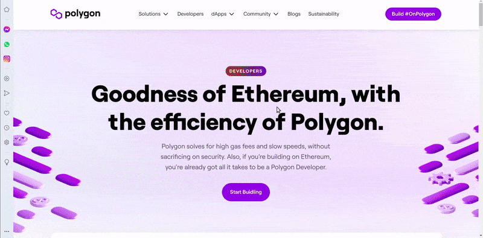
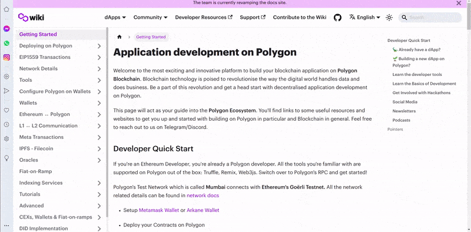

### [NomicLabs](https://nomic.foundation) / [hardhad](https://hardhat.org)

 

> **Nomic Labs** (creator of Hardhat) is becoming the Nomic Foundation, a non-profit organization dedicated to Ethereum’s developer platform, on a mission to empower developers to decentralize the world.

[Naomic labs by medium](https://medium.com/nomic-foundation-blog/introducing-the-nomic-foundation-an-ethereum-public-goods-organization-31012af67df9)

 
 

---

 
 

## 🚧 👷

## Hardhat

(to test but for real contracts, the opposite of remix)

 

> **Hardhat is a development environment to compile, deploy, test, and debug your Ethereum software**. It helps developers manage and automate the recurring tasks that are inherent to the process of building smart contracts and dApps, as well as easily introducing more functionality around this workflow.

 

> ✋ **REMIX** is good to get started but in real life projects developers use something more robust like **Truffle** or **hardhat** ✋

 

### [Truffle](https://trufflesuite.com/) & [hardhat](https://hardhat.org/)

> Are command lines tools, written in **node.js** and you can install them easily with **npm**

 

### Hardhat vs Truffle: Which one is better for writing Smart Contracts?

- With the rising interest and adoption of Web3, there has been an increased demand for developers that know how to write Smart Contracts. Most people who learn to write Smart Contracts will use Remix which is an online IDE. But an online IDE is not feasible for any size development team. You need a tool to be able to write Smart Contracts on your laptop. In this scenario you have two choices: HardHat or Truffle. Let's explore how they compare.

 
 

---

 
 

## POLYGON

 

##### Polygon solves for high gas fees and slow speeds, without sacrificing on security. Also, if you’re building on Ethereum, you're already got all it takes to be a Polygon Developer.

 

> 1. **Polygon Network** is a side chain for increased capacity and lower costs. Written by Seb. Polygon is a protocol and framework for connecting Ethereum compatible blockchains, Polygon also operates a hybrid Proof of Stake and Plasma sidechains.

 

> 2. **Polygon**, formerly known as the Matic Network, is a scaling solution that aims to provide multiple tools to improve the speed and reduce the cost and complexities of transactions on blockchain networks.

The Ethereum blockchain is home to a vast range of economic activity — from NFT markets and games to the growing DeFi ecosystem. **Ethereum is well suited to this activity because it’s compatible with smart contracts**, which can be used to build a vast range of applications.

 

##### [What is Polygon (MATIC)?](https://www.coinbase.com/learn/crypto-basics/what-is-polygon)

However, the growing popularity of these applications adds many transactions to the Ethereum blockchain — and as a result, transaction fees (also known as “gas”) can sometimes rise to the point where making small or frequent investments can be economically unviable.

 

Enter **Polygon**, which is a “Layer 2” scaling solution (or “sidechain”) that’s emerged to **provide faster transactions and lower costs for users.** It acts as a speedy parallel blockchain running alongside the main Ethereum blockchain. To use it, you can “bridge” some of your crypto over to Polygon, and then interact with a wide range of popular crypto apps that were once exclusive to the main Ethereum blockchain.

 

 

### Choose the POS option (like in the gif)

> If you're an Ethereum Developer, you're already a Polygon developer. All the tools you're familiar with are supported on Polygon out of the box: Truffle, Remix, Web3js. Switch over to Polygon's RPC and get started!

 

# 🍊

#### In the same page, look at the left bar and click on the Network Details then in Network or just Go to this page [ Network / Polygon-Mainnet ](https://docs.polygon.technology/docs/develop/network-details/network)

 

 

## Mumbai-testnet

#### For this project in the beginning we will be using Mumbai-Testnet

- 👍 Mumbai Testnet replicates the Polygon Mainnet, which is to be used for testing. Testnet coins are separate and distinct from actual tokens/assets, and are never supposed to have any value. This allows application developers or validators/testers to experiment, without having to use real assets or worrying about breaking the main Polygon chain.

 

| Network name | ParentChain | chainId |
| ------------ | ----------- | ------- |
| Mumbai       | Goerli      | 80001   |

 

  

> Public RPCs may have traffic or rate-limits depending on usage. You can sign up for a dedicated free RPC URL at the following:

  
 
**Alchemy**  ( ✋ I used alchemy in this project [opensea-marketplace](https://github.com/nadiamariduena/opensea-marketplace))
Ankr
Blast (Bware Labs)
BlockPI
Chainstack
DataHub (Figment)
Getblock
**Infura**
MaticVigil
Moralis
Pocket Network
QuickNode
SettleMint

  
  

---

  
  

# INFURA 🌈

#### Another service that you will use is [INFURA](https://infura.io), infura is an API that runs ethereum clients for you.

- its not easy to run ethereum client, so infura is very useful when you want to send a transaction to mainnet

> ✋ Many of Web3’s most remarkable projects—MetaMask, Aragon, Gnosis, OpenZeppelin, and more—utilize Infura’s APIs to connect their applications to the Ethereum network. In doing so, Infura provides the fundamental infrastructure required to handle both the short-term spikes that can often occur during token launches and essential, longer-term scaling solutions.    ✋
> "Our suite of high availability APIs and Developer Tools provide quick, reliable access to the Ethereum and IPFS networks so you can focus on building and scaling next generation software."

 

### [Why Infura Is the Secret Weapon of Ethereum Infrastructure](https://consensys.net/blog/news/why-infura-is-the-secret-weapon-of-ethereum-infrastructure/)

##### Find out how applications and protocols like MetaMask, Aragon, Gnosis, and OpenZeppelin all use Infura for scalable blockchain solutions.

 

#### Create an account there, once its ready, do the following:
