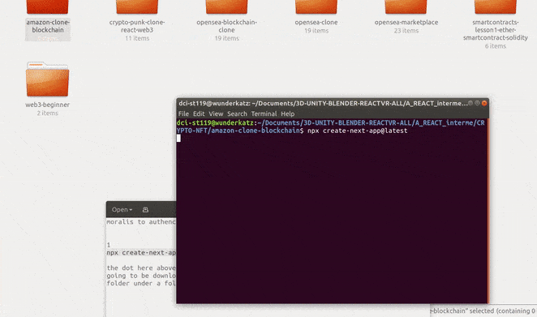
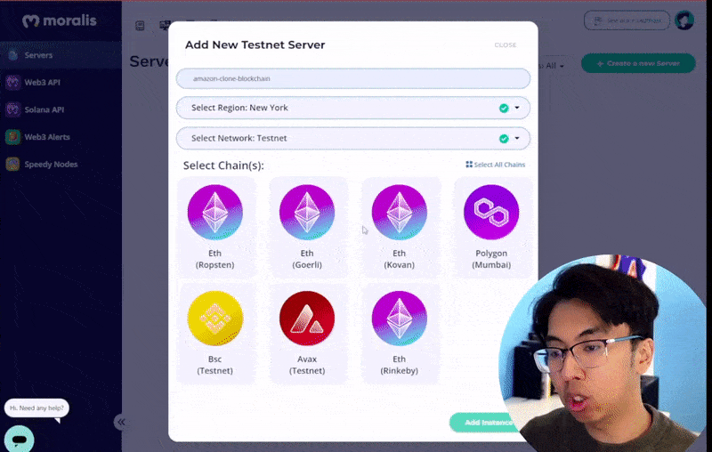
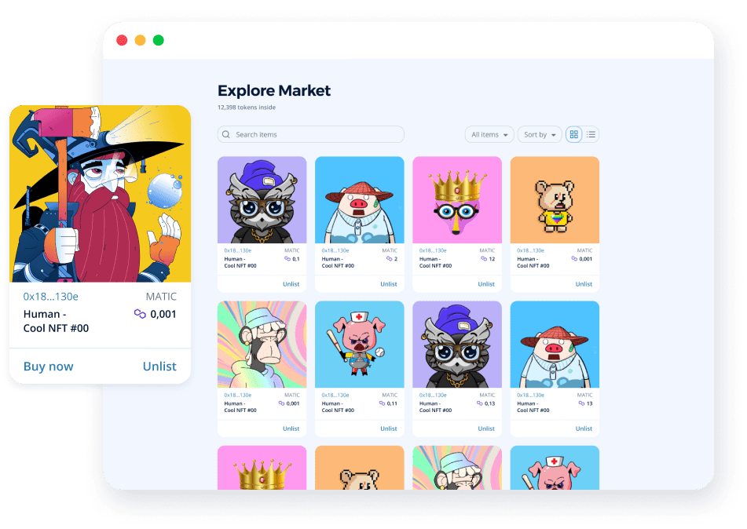

### 1. create the folder for our app 🍨

- Create or go to any folder where you want the project to take place.

<br>

- Open the terminal in that folder and type the following:

```javascript
// mkdir is going to create the folder where you want
mkdir amazon-clone-blockchain
```

<br>

#### 2. Once you do that, you have to <u>cd </u> in the folder

```javascript
// cd will enter to the folder
cd amazon-clone-blockchain
```

<br>

```javascript
npx create-next-app@latest .
```

> the **dot** here above, will make that everything that you are going to upload **"the starter packets related to netxjs"** is going to be downloaded to the amazon-clone-blockchain (so that we dont have a folder under a folder), lets see what happens if we dont add the dot

<br>

###### Here you can see what happens when i remove the dot in the beginning

[]()

<br>
<br>

### 3. Create another folder

- Inside the **amazon-clone-blockchain** create another folder

```javascript
mkdir smart-contracts
```

<br>
<br>

### 4. [Tailwind](https://tailwindcss.com/docs/installation)

```javascript
yarn add -D tailwindcss postcss autoprefixer
// or
npm i -D tailwindcss postcss autoprefixer
```

<br>

#### 5. Now we need to initialize tailwind, run this:

<br>

```javascript
 npx tailwindcss init -p
```

<br>
<br>

- 🔴 It will generate 2 files, **postcss.config.js** and **tailwind.config.js**

 <br>

#### In the files you will find something like this:

<br>

```javascript
// tailwind.config.js
module.exports = {
  content: [],
  theme: {
    extend: {},
  },
  plugins: [],
};
//
// postcss.config.js
//
module.exports = {
  plugins: {
    tailwindcss: {},
    autoprefixer: {},
  },
};
```

> ✋ Later on you will see how we can use them.

<br>

## tailwind configuration

- Go to the **tailwind.config.js** and paste the following:

```javascript

 "./pages/**/*.{js,ts,jsx,tsx}",
    "./components/**/*.{js,ts,jsx,tsx}",
```

<br>

#### Like so:

```javascript
module.exports = {
  content: [
    "./pages/**/*.{js,ts,jsx,tsx}",
    "./components/**/*.{js,ts,jsx,tsx}",
  ],
  theme: {
    extend: {},
  },
  plugins: [],
};
```

<br>

#### Now go to the styles/globals.css, and paste the following code there:

```css
@tailwind base;
@tailwind components;
@tailwind utilities;

/* 


*/
@import url("https://fonts.googleapis.com/css2?family=Ubuntu:ital,wght@0,300;0,400;0,500;0,700;1,300;1,400;1,500;1,700&display=swap");

body {
  background: #fff;
  font-family: "Ubuntu", sans-serif;
}
```

<br>
<br>

#### At this point we are ready to launch the server to see if the app is working

```javascript
npm run dev
```

<br>
<br>

# 🌈

## [Moralis](https://admin.moralis.io/servers)

<br>

([Moralis](https://admin.moralis.io/servers) is like the firebase of crypto development, so its going to make things much easier as it has already read made functions for that and more.)

<br>
<br>

> **Moralis provides managed backend for blockchain projects.** Automatically syncing the balances of your users into the database, allowing you to set up on-chain alerts, watch smart contract events, build indexes, and so much more. All features are accessed through an easy-to-use SDK.

#### Create an account there

###### Check also [Moralis Metaverse](https://moralis.io/metaverse/)

<br>

#### Once you have your account setup, proceed to create the server in Moralis

- at the left you will see a couple of options, right now we will be creating the server, so click on **servers** , then click on the green button and choose the **testnet server**

<br>

- 🔴 when the form will open, you will add a name for the server, you will also **select a region** , choose the **testnet server** again and then for the **chain** (the colorful icons) select the **Rinkeby testnet**

<br>

[]()

<br>

#### As you can see here below, we will be using 3 things

<br>

- Server Url

- Application Id

- Master key

<br>

[]()

<br>

> What you see at the end of the gif is a dashboard, there we will see the sensitive data related to the user (later on)

<br>

<br>

### After the account and the new project was created, intall the moralis dependencies:

<br>

```javascript
yarn add moralis react-moralis
// or
npm i moralis react-moralis
```

<br>

- after that you should have this

```javascript
  "dependencies": {
    "moralis": "^1.7.0", ✋
    "next": "12.1.6",
    "react": "18.1.0",
    "react-dom": "18.1.0",
    "react-moralis": "^1.3.5" ✋
  },
```

<br>
<br>

# :watermelon:

### Install the icons, spinners, modal

```javascript
npm i react-icons react-spinners react-simple-hook-modal
```

<br>

# 🍨

### Wallet connect / web3auth ethers

<br>

```javascript
npm i @walletconnect/web3-provider @web3auth/web3auth ethers
```

<br>

### What is <u>WalletConnect</u> used for?

WalletConnect is an open protocol for connecting desktop Dapps to mobile Wallets using end-to-end encryption by scanning a QR code. Opening up a whole world of Dapps that were once only available to Metamask.

<br>

#### What is a web3 provider?

- **Web3 providers, also known as Node providers**, are essentially blockchain data keepers. These projects run networks of hundreds of blockchain nodes, and are tasked with providing applications with the latest and historical blockchain data. The Web3 provider is an essential part of a blockchain-powered application

##### Read more here: [The Importance of Web3 Provider Redundancy](https://blog.quicknode.com/the-importance-of-web3-provider-redundancy/)

<br>

#### What is <u>Ethers</u> ?

The ethers.js library aims to be a complete and compact library for interacting with the Ethereum Blockchain and its ecosystem. It was originally designed for use with ethers.io and has since expanded into a more general-purpose library.

<br>

##### After the installation, You should have this:

```javascript
 "dependencies": {
    "@walletconnect/web3-provider": "^1.7.8", ✋
    "@web3auth/web3auth": "^1.0.0-alpha.0", ✋
    "ethers": "^5.6.6", ✋
    "moralis": "^1.7.0",
    "next": "12.1.6",
    "react": "18.1.0",
    "react-dom": "18.1.0",
    "react-icons": "^4.3.1",
    "react-moralis": "^1.3.5",
    "react-simple-hook-modal": "^1.1.0",
    "react-spinners": "^0.12.0"
  },
```

<br>
<br>

# 🍨

## Install <u>magic sdk </u> / moment / web3uikit

```javascript
npm i magic-sdk moment web3uikit
```

<br>

### [Magic](https://magic.link) SDK

> [Magic](https://magic.link/docs?utm_term=development%20kit&utm_campaign=New+website+clicks+campaign&utm_source=adwords&utm_medium=ppc&hsa_acc=7367440521&hsa_cam=13250211335&hsa_grp=125623972231&hsa_ad=523835832850&hsa_src=g&hsa_tgt=kwd-21353726&hsa_kw=development%20kit&hsa_mt=b&hsa_net=adwords&hsa_ver=3&gclid=Cj0KCQjw-JyUBhCuARIsANUqQ_Kysd6a8zuhwPEztViI1ePysfJoZWPp1uWyDwBWvIz8wKSDsc40RSMaAqkoEALw_wcB) is a developer SDK that integrates with your application **to enable passwordless Web3 onboarding (no seed phrases) and authentication using magic links (similar to Slack and Medium)** ✋. Magic enables blazing-fast, hardware-secured, passwordless login, Web3 onboarding, and access to over 20 blockchains with a few lines of code — even if you have an existing auth solution.

<br>

### [Web3UI Kit](https://github.com/web3ui/web3uikit)

<br>

Lightweight reusable Web3 UI components for dapps developers. Web3UIKit accelerates your dapp development and empowers you to build beautiful dapps.

See how it works here [Web3UI Kit](https://github.com/web3ui/web3uikit)

[]()

<br>
<br>
<br>

## Moment 📅

> Parse, validate, manipulate, and display dates in javascript.

#### See an example here: [momentjs.com](https://momentjs.com)

<br>
<br>

#### After the installation, You should have this:

```javascript
  "dependencies": {
    "@walletconnect/web3-provider": "^1.7.8",
    "@web3auth/web3auth": "^1.0.0-alpha.0",
    "ethers": "^5.6.6",
    "magic-sdk": "^8.1.1",
    "moment": "^2.29.3",
    "moralis": "^1.7.0",
    "next": "12.1.6",
    "react": "18.1.0",
    "react-dom": "18.1.0",
    "react-icons": "^4.3.1",
    "react-moralis": "^1.3.5",
    "react-simple-hook-modal": "^1.1.0",
    "react-spinners": "^0.12.0",
    "web3uikit": "^0.1.149"
  },
```
