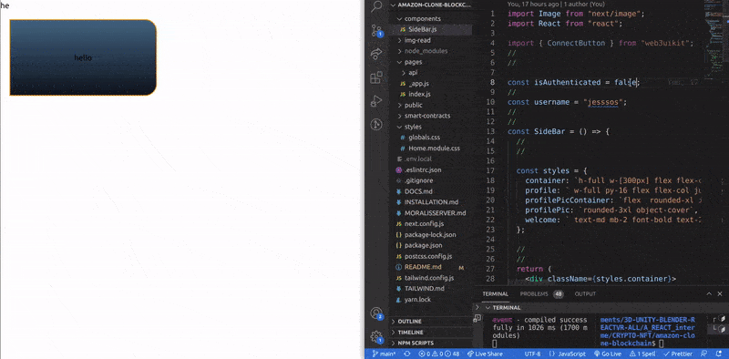
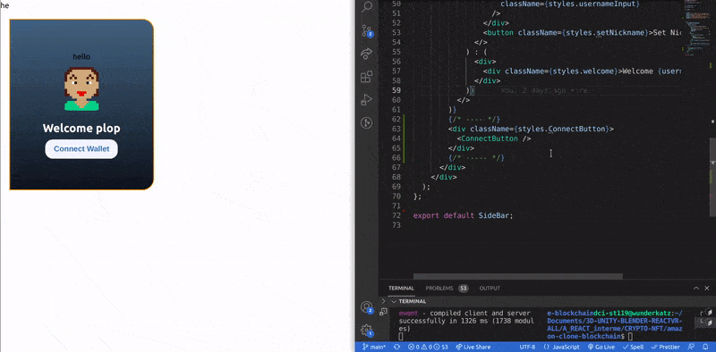

### [Build Amazon Web 3.0 Blockchain App with Solidity | Moralis | Next.js | Ethers.js | Tailwind CSS](https://youtu.be/HMdwbq1JJT0)

- Building a Web 3.0 Application on the Ethereum Blockchain

- Styling your app using Tailwind CSS

- Storing data on the blockchain

- Using Moralis and Interact with your Smart Contract written in Solidity

- Adding Web 3.0 authentication using Metamask

 <br>
 <br>

##### Ckeck the Installation here: [installation ✋](./INSTALLATION.md)

#### Ckeck the Documents here: [docs ✋](./DOCS.md)

 <br>
 <br>

---

 <br>
 <br>

# 🥭

#### After the Installation

- Go to the **pages** folder, then click on the **index.js**

- delete all and leave just this:

```javascript
export default function Home() {
  return <div className={styles.container}></div>;
}
```

<br>
<br>

#### Now lets start adding tailwind to the project

- Here we are adding tailwind to the **container**

```javascript
const styles = {
  // Check the links to see how it works
  //   h-full	height: 100%; &  w-full	height: 100%;
  // h-full https://tailwindcss.com/docs/height
  // w-full https://tailwindcss.com/docs/width
  container: `h-full w-full flex bg-[#fff]`,
};

export default function Home() {
  return <div className={styles.container}></div>;
}
```

<br>

### Create a <u>components</u> folder

- Inside the component folder, create a the **SideBar.js** component, inside the SideBar add this:

```javascript
import React from "react";

const SideBar = () => {
  return <div>SideBar</div>;
};

export default SideBar;
```

<br>

#### Now import it inside the index.js

```javascript
import SideBar from "../components/SideBar"; ✋

const styles = {
  container: `h-full w-full flex bg-[#fff]`,
};

export default function Home() {
  return (
    <div className={styles.container}>
      <SideBar /> ✋
    </div>
  );
}
```

<br>
<br>

# 🌈

## .ENV.LOCAL

[Next.js Tutorial - 64 - Environment Variables](https://youtu.be/vS86x_e0zBk)

#### [Moralis / server](https://admin.moralis.io/servers)

- Create a **.env.local** (nextjs version of the .env) file , there we will store sensitive data, (the data we have in Moralis)

<br>

> Copy your own credentials from [Moralis / server](https://admin.moralis.io/servers) ✋ (take the **Server URL** and the **Application ID**)

<br>

[]()

<br>

#### Create the variables inside the .env.local:

<br>

- the variables are: **NEXT_PUBLIC_MORALIS_SERVER**

- **NEXT_PUBLIC_MORALIS_APP_ID**

```javascript
NEXT_PUBLIC_MORALIS_SERVER=https://https:yourlongcode/server
NEXT_PUBLIC_MORALIS_APP_ID=JLzlehyourlongcode
```

<br>

### 🐒 Moralis provider

<br>

- Go to the **pages/\_app.js**

- import moralisprovider: **import { MoralisProvider } from "react-moralis";**

- Wrap the app content inside the **Moralis provider**

```javascript
function MyApp({ Component, pageProps }) {
  <MoralisProvider>
    return <Component {...pageProps} />;
  </MoralisProvider>;
}
```

<br>

### Now inside the Moralis provider tag

- add the **serverUrl** but here we will use the environments we added insid ethe **.env.local**

<br>

```javascript
  serverUrl={process.env.NEXT_PUBLIC_MORALIS_SERVER}
  appId={process.env.NEXT_PUBLIC_MORALIS_APP_ID}
```

<br>

#### Like so:

```javascript
<MoralisProvider
  serverUrl={process.env.NEXT_PUBLIC_MORALIS_SERVER}
  appId={process.env.NEXT_PUBLIC_MORALIS_APP_ID}
>
  return <Component {...pageProps} />;
</MoralisProvider>
```

<br>
<br>

#### Right now we have this inside the **\_app.js**

```javascript
import "../styles/globals.css";
import { MoralisProvider } from "react-moralis";

function MyApp({ Component, pageProps }) {
  return (
    <MoralisProvider
      serverUrl={process.env.NEXT_PUBLIC_MORALIS_SERVER}
      appId={process.env.NEXT_PUBLIC_MORALIS_APP_ID}
    >
      <Component {...pageProps} />
    </MoralisProvider>
  );
}

export default MyApp;
```

#### if at this point you have an error, just check that you didnt mistype anything or that you dont have semi colons where it shouldnt be, then stop the server and relaunch it again

```javascript
npm run dev
```

<br>
<br>

---

<br>
<br>

### Connect Button

- Go to the **SideBar.js** and import the **web3uikit** library, this button will be ready to use.

<br>

- import the

```javascript
import { ConnectButton } from "web3uikit";
```

#### And use it like so

```javascript
import React from "react";
import { ConnectButton } from "web3uikit";

const SideBar = () => {
  return (
    <div>
      <ConnectButton /> ✋
    </div>
  );
};

export default SideBar;
```

<br>

> 💯 **The incredible of this button, is that it has already some functionality!!!**, so if you click on it you will have some options(_since I am using metamask, i will click on it._)

<br>

[]()

<br>

#### after you click on metamask, you have to click to sign in "moralis" (you cannot really see it on the image, but you have to click in the blue button that is on the side of the cancel button)

[]()

<br>

> You will see that we have a user, and that is because every time we log in(**by clicking on the button** we just added), it will count as a new user. 🌈

<br>
<br>

## To recap 🥭

##### 1. log into Moralis

##### 2. Click on the button we just added in our app

##### 3. Log in Metamask

##### 4. While logged in Metamask, click in the signin Moralis (through the popup window of the metamask)

##### 5. Go to Moralis (click on the arrow to unfold some options)

##### 6. click on the dashboard

##### 7. Once you are in the dashboard

> you will see that we have a user, and that is because every time we log in(**by clicking on the button** we just added), it will count as a new user. 🌈

<br>
<br>

[]()

<br>
<br>
---

<br>
<br>

### Go to the SideBar.js

- declare the following variable, this variable will be related to **Moralis**

```javascript
const isAuthenticated = false;
```

#### We will be wrapping some stuff inside the isAuthenticated

```javascript
//
//    ** BEFORE **
//
import React from "react";
import { ConnectButton } from "web3uikit";
//
//

const isAuthenticated = false;

//
//
const SideBar = () => {
  return (
    <div>
      <ConnectButton />
    </div>
  );
};

export default SideBar;
```

### process

- ⚠️ At this point we will have some errors but dont mind, we will solve it in the next step **(the errors are due to the classnames, since we dont have them yet )**

```javascript
import Image from "next/image";
import React from "react";

import { ConnectButton } from "web3uikit";
//
//

const isAuthenticated = false;

//
//
const SideBar = () => {
  return (
    <div className={styles.container}>
      <div className={styles.profile}>
        {isAuthenticated && (
          <>
            <div className={styles.profilePicContainer}>
              <Image
                alt="profile"
                className={styles.profilePic}
                height={100}
                width={100}
              />
            </div>
          </>
        )}
      </div>

      <ConnectButton />
    </div>
  );
};

export default SideBar;
```

### Conditionals

- **By default we dont have an user name** (when you eneter a page you are never logged in, later on you click on login, there comes this question)

<br>

#### So if there is not user name, we want to do something...

```javascript
{!username ? ( ) : ( )} //✋
// {!username ? (if we dont have an username we will do this) : (if we have it, we will do this)}
```

<br>

#### If we dont have a username logged then of course we want to show a form "input", to give the user the option to log in

- We dont have this yet **onClick = {handleSetUsername}** that is why its hidden

<br>

```javascript
{!username ? (
//
//
<>
 {/*✋ if we dont have user logged,
  show this input form:  */}
 <div className={styles.username}>
       <input
        type="text"
        placeholder="Username..."
        className={usernameInput}
        />
  </div>
       <button
         className={styles.setNickname}
         // 🍭 onClick = {handleSetUsername}
                >
        Set Nickname
        </button>
              </>
              //
              //

) : ( )} //✋

```

<br>
<br>

### At the end you will have something like this:

- 🌵 in case we have a user logged i, we will show something that says <u>welcome jey</u> but **only until we have the rest of the content**

<br>

⚠️ DOnt mind about the styles, we will take care of them later

<br>

```javascript
{
  isAuthenticated && (
    <>
      <div className={styles.profilePicContainer}>
        <Image
          alt="profile"
          className={styles.profilePic}
          height={100}
          width={100}
        />
      </div>
      {!username ? (
        <>
          {/* ✋ if we dont have user logged,
               show this input form: */}
          <div className={styles.username}>
            <input
              type="text"
              placeholder="Username..."
              className={usernameInput}
            />
          </div>
          <button
            className={styles.setNickname}
            // 🍭 onClick = {handleSetUsername}
          >
            Set Nickname
          </button>
        </>
      ) : (
        <>
          {/* 🌵 if we have a user logged,
               show this: */}
          <div className={styles.welcome}>Welcome jey</div>
        </>
      )}
    </>
  );
}
```

<br>
<br>

### Styles

- Inside the **profile** we have the **gradient** that gives the bluish color to the box

```javascript

const SideBar = () => {
  //
  //

  const styles = {
    container: `h-full w-[300px] flex flex-col bg-[#fff] static`,
    profile: ` w-full py-16 flex flex-col justify-center items-center rounded-r-3xl bg-gradient-to-t from-[#0d141c] to-[#42667e] mt-[40px] mb-[50px] border-2 border-[#fb9701]`,
    profilePicContainer: `flex  rounded-xl items-center justify-center w-full h-full mb-5`,
    profilePic: `rounded-3xl object-cover`,
    welcome: ` text-md mb-2 font-bold text-2xl text-white`,
  };

  //
  //
  return (
```

<br>
<br>

### 🔴 If at this point you dont have anything in your browser (no boxes)

- Test if everything is okay by typing "hallo" here:

```javascript
  <div className={styles.profile}>
        hallo
        {isAuthenticated && (
          <>
```

<br>

#### 🌈 if you see the text hallo showing, then its something else, probably the tailwind config

- Go to the **tailwind.config.js**

```javascript
module.exports = {
  content: [
    "./pages/**/*.{js,ts,jsx,tsx}",
    "./components/**/*.{js,ts,jsx,tsx}",
  ],
  theme: {
    extend: {},
  },
  plugins: [],
};
```

<br>
<br>

### the code before we continue 🥭

- I added a variable called **username**, check the yellow hands to see where I use it

<br>

```javascript
import Image from "next/image";
import React from "react";

import { ConnectButton } from "web3uikit";
//
//

const isAuthenticated = false;
//
const username = "jesssos"; ✋
//
//
const SideBar = () => {
  //
  //

  const styles = {
    container: `h-full w-[300px] flex flex-col bg-[#fff] static`,
    // Gradient ---
    profile: ` w-full py-16 flex flex-col justify-center items-center rounded-r-3xl bg-gradient-to-t from-[#0d141c] to-[#42667e] mt-[40px] mb-[50px] border-2 border-[#fb9701]`,
    // ------------
    profilePicContainer: `flex  rounded-xl items-center justify-center w-full h-full mb-5`,
    profilePic: `rounded-3xl object-cover`,
    welcome: ` text-md mb-2 font-bold text-2xl text-white`,
  };

  //
  //
  return (
    <div className={styles.container}>
      <div className={styles.profile}>
        hello
        {isAuthenticated && (
          <>
            <div className={styles.profilePicContainer}>
              <Image
                src={`https://avatars.dicebear.com/api/pixel-art/${username}.svg`} ✋
                alt="profile"
                className={styles.profilePic}
                height={100}
                width={100}
              />
            </div>
            {!username ? (
              <>
                <div className={styles.username}>
                  <input
                    type="text"
                    placeholder="Username...."
                    className={styles.usernameInput}
                  />
                </div>
                <button className={styles.setNickname}>Set Nickname</button>
              </>
            ) : (
              <div>
                <div className={styles.welcome}>Welcome {username}</div> ✋
              </div>
            )}
          </>
        )}
      </div>
    </div>
  );
};
```

<br>
<br>

# 🌵

### Now add the following inside the <u>next.config.js</u>

<br>

- So here we need and **images key** with an **object** and a **domain key** with an **array**

```javascript
/** @type {import('next').NextConfig} */ const nextConfig = {
  reactStrictMode: true,
  images: {
    domains: [
      "lh3.googleusercontent.com",
      "openseauserdata.com",
      "brand.assets.adidas.com",
      "media0.giphy.com",
      "avatars.dicebear.com",
      "media1.giphy.com",
      "media3.giphy.com",
      "media2.giphy.com",
      "media4.giphy.com",
    ],
  },
};

module.exports = nextConfig;
```

<br>

- As you can see, this is what we just added in the url for the image **"avatars.dicebear.com",**

<br>
<br>

#### before and after

<br>

```javascript
/** @type {import('next').NextConfig} */
const nextConfig = {
  reactStrictMode: true,
};

module.exports = nextConfig;

/*


  @type {import('next').NextConfig}   const nextConfig = {  reactStrictMode: true,
  images: {
    domains: [
      'lh3.googleusercontent.com',
      'openseauserdata.com',
      'brand.assets.adidas.com',
      'media0.giphy.com',
      'avatars.dicebear.com',
      'media1.giphy.com',
      'media3.giphy.com',
      'media2.giphy.com',
      'media4.giphy.com',
    ],
  },
}

module.exports = nextConfig


*/
```

<br>

<br>

[]()

<br>

> 🌞 So as you can see, if you are authenticated its going to load the image, but keep in mind this is only to mimic an authentication 🌞

<br>
<br>

---

<br>

### Add the connectButton

- Its the button we had before we add the whole code related to the avatar.

<br>

```javascript
       )}
        {/* ---- */}
        <div className={styles.ConnectButton}>
          <ConnectButton />
        </div>
        {/* ----- */}
      </div>
    </div>
  );
};

export default SideBar;

```

<br>

[]()
