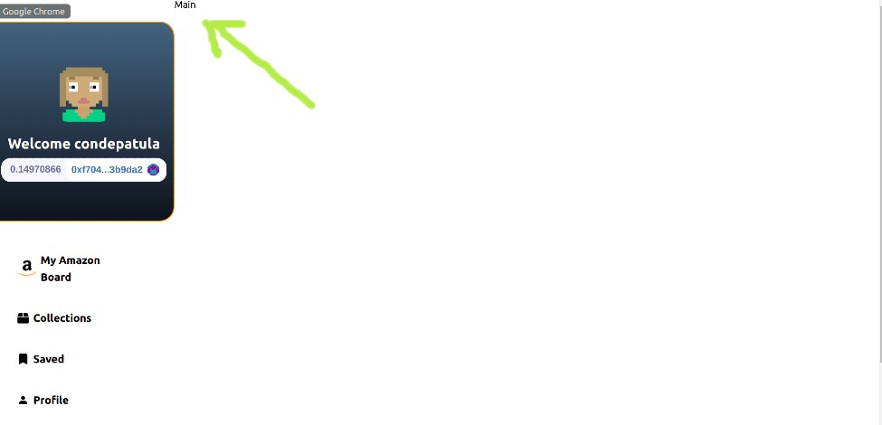

### [Build Amazon Web 3.0 Blockchain App with Solidity | Moralis | Next.js | Ethers.js | Tailwind CSS](https://youtu.be/HMdwbq1JJT0)

 <br>
 <br>

#### Check the [installation ✋](https://github.com/nadiamariduena/amazon-clone-blockchain/blob/2-Auth-moralis-context/INSTALLATION.md)

#### Check the [docs ✋](https://github.com/nadiamariduena/amazon-clone-blockchain/blob/2-Auth-moralis-context/DOCS.md)

#### Check: [Moralis server basic](https://github.com/nadiamariduena/amazon-clone-blockchain/blob/2-Auth-moralis-context/MORALISSERVER.md)

#### Check: [tailwind](https://github.com/nadiamariduena/amazon-clone-blockchain/blob/2-Auth-moralis-context/TAILWIND.md)

 <br>
 <br>

---

 <br>
 <br>

# 🥭

<!--
[]() -->

### Showing the assets in our App

- Before adding the assets, we will need to create a new component in our App, this component will be called **components/Main.js**

<br>

- Add the following

```javascript
import React from "react";

const Main = () => {
  return <div>Main</div>;
};

export default Main;
```

<br>

#### Now go to the pages/indexjs and uncover the Main.js

```javascript
export default function Home() {
  return (
    <div className={styles.container}>
      <SideBar />
      <Main />
    </div>
  );
}
```

<br>

[]()
