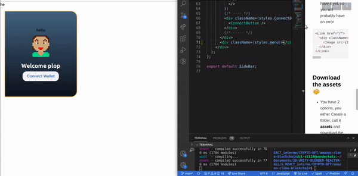
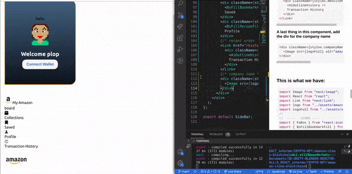
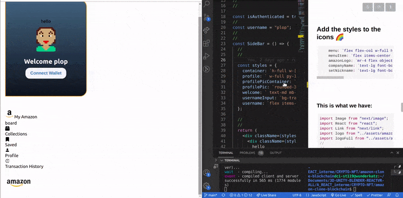
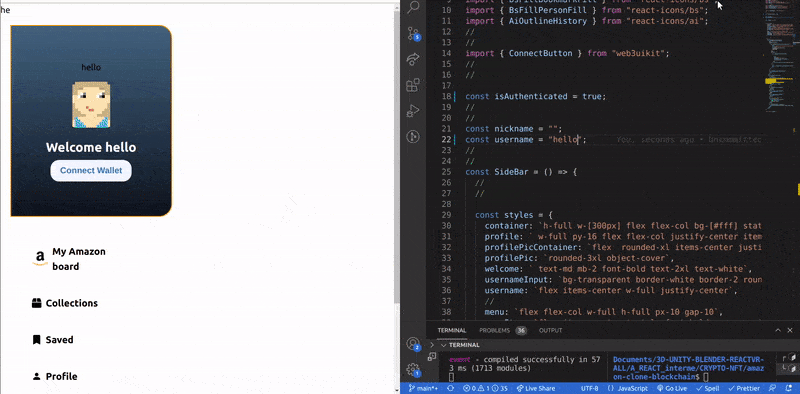
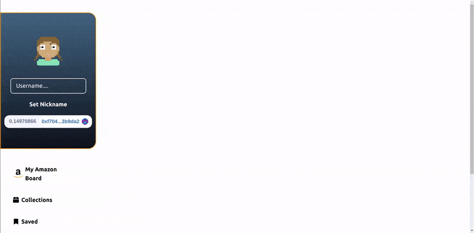

### [Build Amazon Web 3.0 Blockchain App with Solidity | Moralis | Next.js | Ethers.js | Tailwind CSS](https://youtu.be/HMdwbq1JJT0)

 <br>
 <br>

#### Ckeck the Installation here: [installation ✋](./INSTALLATION.md)

#### Ckeck the Documents here: [docs ✋](./DOCS.md)

<br>

#### The whole code after we finish this section:

[Code](https://github.com/nadiamariduena/amazon-clone-blockchain/blob/2-Auth-moralis-context/CODE.md)

 <br>
 <br>

---

 <br>
 <br>

# 🥭

#### Lets set up the rest of the menu

```javascript
        {/* ---- */}
        <div className={styles.ConnectButton}>
          <ConnectButton />
        </div>
        {/* ----- */}
        <div className={styles.menu}></div> ✋
      </div>
    </div>
  );
};
```

<br>

#### After you make that did, I dont know if you knew but when you are working with <u>nextjs</u>, you can actually do some routing to different pages, instead of getting a react router

<br>

- So to add the router, start by importing the nextjs **link**

```javascript
import Link from "next/link";
```

#### Then add the following here:

> The reason why we want to give an **href** before **slash /**, is because I am going to put the amazon logo here, so that when **you click in the amazon logo, you can go back to the home page**

```javascript
<Link href="/"></Link>
```

<br>

### Like so

- the **logo img src** we dont have it yet, so you will probably have an error

```javascript
<Link href="/">
  <div className={styles.menuItem}>
    <Image src={logo} height={30} width={30} className={styles.amazonLogo} />
  </div>
</Link>
```

<br>

### Download the assets 📦

- You have 2 options, you either Create a folder, call it **assets** and download the images from this [link](/home/dci-st119/Downloads/amazon-blockchain-youtube-main/assets) ( ✋ or you can also **download** the whole repo, copy paste the whole folder into yours)

<br>

### Once you have the assets

- Add the img's that we will be using to the sideBar.js:

```javascript
import logo from "../assets/amazon_logo.png";
import logoFull from "../assets/amazon_logo_full.png";
```

[]()

<br>

#### This is what we have:

```javascript
import Image from "next/image";
import React from "react";
import Link from "next/link";
import logo from "../assets/amazon_logo.png";
import logoFull from "../assets/amazon_logo_full.png";
//
import { ConnectButton } from "web3uikit";
//
//

const isAuthenticated = true;
//
const username = "plop";
//
//
const SideBar = () => {
  //
  //

  const styles = {
    container: `h-full w-[300px] flex flex-col bg-[#fff] static`,
    profile: ` w-full py-16 flex flex-col justify-center items-center rounded-r-3xl bg-gradient-to-t from-[#0d141c] to-[#42667e] mt-[40px] mb-[50px] border-2 border-[#fb9701]`,
    profilePicContainer: `flex  rounded-xl items-center justify-center w-full h-full mb-5`,
    profilePic: `rounded-3xl object-cover`,
    welcome: ` text-md mb-2 font-bold text-2xl text-white`,
    usernameInput: `bg-transparent border-white border-2 rounded-lg w-[80%] py-2 px-4 text-lg mt-[20px] placeholder:text-white focus:outline-none flex justify-center items-center text-white`,
    username: `flex items-center w-full justify-center`,
  };

  //
  //
  return (
    <div className={styles.container}>
      <div className={styles.profile}>
        hello
        {isAuthenticated && (
          <>
            <div className={styles.profilePicContainer}>
              <Image
                src={`https://avatars.dicebear.com/api/pixel-art/${username}.svg`}
                alt="profile"
                className={styles.profilePic}
                height={100}
                width={100}
              />
            </div>
            {!username ? (
              <>
                <div className={styles.username}>
                  <input
                    type="text"
                    placeholder="Username...."
                    className={styles.usernameInput}
                  />
                </div>
                <button className={styles.setNickname}>Set Nickname</button>
              </>
            ) : (
              <div>
                <div className={styles.welcome}>Welcome {username}</div>
              </div>
            )}
          </>
        )}
        {/* ---- */}
        <div className={styles.ConnectButton}>
          <ConnectButton />
        </div>
        {/* ----- */}
      </div>
      <div className={styles.menu}>
        <Link href="/">
          <div className={styles.menuItem}>
            <Image
              src={logo}
              height={30}
              width={30}
              className={styles.amazonLogo}
            />{" "}
            My Amazon <br /> board
          </div>
        </Link>
      </div>
    </div>
  );
};

export default SideBar;
```

<br>
<br>

### Lets continue with the next <u>menuItem</u>

```javascript
<div className={styles.menuItem}>
  <FaBox />
  Collections
</div>
```

<br>

## 🌈

### Add the icons

- All the icons are coming from the dependeny that I installed in the beginning **react-icons**

```javascript
//  ----   ICONS ----
import { FaBox } from "react-icons/fa";
import { BsFillBookmarkFill } from "react-icons/bs";
import { BsFillPersonFill } from "react-icons/bs";
import { AiOutlineHistory } from "react-icons/ai";
//
//
import { ConnectButton } from "web3uikit";
//
```

#### Now add the rest of the menu items, so to match the icons above

```javascript

  {/* icons */}
  <div className={styles.menuItem}>
    <FaBox />
    Collections
  </div>
  <div className={styles.menuItem}>
    <BsFillBookmarkFill />
    Saved
  </div>
  <div className={styles.menuItem}>
    <BsFillPersonFill />
    Profile
  </div>

```

<br>
<br>

## 🍭

### Now lets add one more icon (you will see the preview after this)

<br>

- 🔴 The difference with this one, is that its wrapped inside the **history** (we dont have the history yet, but we will add it anyway)

<br>

- the history is going to give us a couple of things but here it will give us the **recent order**

```javascript
<Link href="/history">
  <div className={styles.menuItem}>
    <AiOutlineHistory />
    Transaction History
  </div>
</Link>
```

<br>

#### A last thing in this component, add the div for the company name

<br>

```javascript
<div className={styles.companyName}>
  <Image src={logoFull} alt="amazon" height={100} width={100} />
</div>
```

<br>

[]()

<br>
<br>

### Add the styles to the icons 🌈

```javascript
    menu: `flex flex-col w-full h-full px-10 gap-10`,
    menuItem: `flex items-center text-lg font-bold cursor-pointer gap-2`,
    amazonLogo: `mr-4 flex object-cover`,
    companyName: `text-lg font-bold flex flex-1 pl-10 items-center mt-[20px]`,
    setNickname: `text-lg font-bold flex flex-1 items-center mt-[20px] mb-[20px] text-white`,
```

[]()

<br>
<br>

#### This is what we have:

```javascript
import Image from "next/image";
import React from "react";
import Link from "next/link";
import logo from "../assets/amazon_logo.png";
import logoFull from "../assets/amazon_logo_full.png";
//
//  ----   ICONS ----
import { FaBox } from "react-icons/fa";
import { BsFillBookmarkFill } from "react-icons/bs";
import { BsFillPersonFill } from "react-icons/bs";
import { AiOutlineHistory } from "react-icons/ai";
//
//
import { ConnectButton } from "web3uikit";
//
//

const isAuthenticated = true;
//
const username = "plop";
//
//
const SideBar = () => {
  //
  //

  const styles = {
    container: `h-full w-[300px] flex flex-col bg-[#fff] static`,
    profile: ` w-full py-16 flex flex-col justify-center items-center rounded-r-3xl bg-gradient-to-t from-[#0d141c] to-[#42667e] mt-[40px] mb-[50px] border-2 border-[#fb9701]`,
    profilePicContainer: `flex  rounded-xl items-center justify-center w-full h-full mb-5`,
    profilePic: `rounded-3xl object-cover`,
    welcome: ` text-md mb-2 font-bold text-2xl text-white`,
    usernameInput: `bg-transparent border-white border-2 rounded-lg w-[80%] py-2 px-4 text-lg mt-[20px] placeholder:text-white focus:outline-none flex justify-center items-center text-white`,
    username: `flex items-center w-full justify-center`,
  };

  //
  //
  return (
    <div className={styles.container}>
      <div className={styles.profile}>
        hello 👾
        {isAuthenticated && (
          <>
            <div className={styles.profilePicContainer}>
              ✋
              <Image
                src={`https://avatars.dicebear.com/api/pixel-art/${username}.svg`}
                alt="profile"
                className={styles.profilePic}
                height={100}
                width={100}
              />
            </div>
            👾👾👾
            {!username ? (
              <>
                <div className={styles.username}>
                  <input
                    type="text"
                    placeholder="Username...."
                    className={styles.usernameInput}
                  />
                </div>
                <button className={styles.setNickname}>Set Nickname</button>
              </>
            ) : (
              <div>
                <div className={styles.welcome}>Welcome {username}</div>
              </div>
            )}
            👾👾👾
          </>
        )}
        👾
        {/* ---- */} 🦖
        <div className={styles.ConnectButton}>
          <ConnectButton />
        </div>
        {/* ----- */}
      </div>
      <div className={styles.menu}>
        {/* amazon */} ✋
        <Link href="/">
          <div className={styles.menuItem}>
            <Image
              src={logo}
              height={30}
              width={30}
              className={styles.amazonLogo}
            />{" "}
            My Amazon <br /> board
          </div>
        </Link>
        {/* icons */} ✋<div className={styles.menuItem}>
          <FaBox />
          Collections
        </div>
        <div className={styles.menuItem}>
          <BsFillBookmarkFill />
          Saved
        </div>
        <div className={styles.menuItem}>
          <BsFillPersonFill />
          Profile
        </div>
        {/* recent order  HISTORY */} ✋
        <Link href="/history">
          <div className={styles.menuItem}>
            <AiOutlineHistory />
            Transaction History
          </div>
        </Link>
        {/* company name */} ✋<div className={styles.companyName}>
          <Image src={logoFull} alt="amazon" height={100} width={100} />
        </div>
      </div>
    </div>
  );
};

export default SideBar;
```

<br>
<br>

---

<br>
<br>

# 🐖

### Context

- We will create all the variables and functions inside the context, **with the context we will be able to call the variables functions anywhere in the app** by making them global

<br>

#### Create the folder context

- Inside the root folder, create a folder and call it **context**

<br>

- Inside the **context folder** create a component and call it **AmazonContext.js**

<br>

<br>

#### import the following

```javascript
import { createContext, useState, useEffect } from "react";
import { useMoralis, useMoralisQuery } from "react-moralis";
import { amazonAbi, amazonCoinAddress } from "../lib/constants";
import { ethers } from "ethers";
```

<br>
<br>

```javascript
// 1
export const AmazonContext = createContext();
//
// 2
export const AmazonProvider = ({ children }) => {
  //
  //
  return (
    // 3
    <AmazonContext.Provider
      //4
      value={
        {
          /* everything that is going to be 
            wrapped here "between the curly brackets",
          is going to be global  */
        }
      }
    >
      {children}
    </AmazonContext.Provider>
  );
};
```

<br>

> But before we can pass the values, (in step4) we need to create a couple of things.

<br>
<br>

## PROVIDER 🌈

### At this point the <u>CONTEXT</u> is set up, all we need to do now is going to the <u>pages/\_app.js</u> ... and wrap the amazon provider we just created.

<br>

- ✋ Import the **context** as **AmazonProvider**

<br>

> As you can see below, we are bringing the data from the other component we just created, the one containing the context.

```javascript
import { AmazonProvider } from "../context/AmazonContext";
```

<br>

### Now wrap the content inside the amazon provider

<br>

> As you can see, inside the AmazonProvider, we have the MoralisProvider containing the **enviroments keys** and also our component

```javascript
// ✋
<AmazonProvider>
  <MoralisProvider
    serverUrl={process.env.NEXT_PUBLIC_MORALIS_SERVER}
    appId={process.env.NEXT_PUBLIC_MORALIS_APP_ID}
  >
    <Component {...pageProps} />
  </MoralisProvider>
</AmazonProvider>
// ✋
```

<br>
<br>

### So once we do that, we are able to use context within the app

- Go to the **SideBar.js** and replace true for false, the reason for that is because right now its hard coded and we want to make it dynamical by using **Moralis**

```javascript
const isAuthenticated = false;
```

<br>

#### Also add the **nickname** here

```javascript
const nickname = ""; ✋
const username = "plop";
```

#### and here

```javascript
     {!username ? (
              <>
                <div className={styles.username}>
                  <input
                    type="text"
                    placeholder="Username...."
                    className={styles.usernameInput}
                    value={nickname} ✋
                  />
                </div>
                <button className={styles.setNickname}>Set Nickname</button>
              </>
```

<br>
<br>

#### Now what we want to do is that when we log in, we want that to show that <u>we are logged in as a USER</u>

<br>

- 1 Log in to metamask and Moralis through our app, by clicking **connect**, then log you out **metamask**

- 2 Go to **Moralis** and delete any user that is logged in

🔴 (there is a trick, delete the first row, as if you delete the 2 row, it will not work)

<br>

<br>

[]()

<br>
<br>

## useState 🍨 hook

- we will use the **useState hook** to keep track of a couple of things

<br>

- First thing we will create is a variable with the state of our **username**, if you recall it, we have a **username** inside the **sideBar.js** , the username controls what the username is, so by adding this state with the **username** we will be linking anything that will change to it.

<br>

> const [username, setUsername] = useState("");

<br>

```javascript

// so this control what our user name is
  const [username, setUsername] = useState(""); ✋

  //
  //
  return (
    <AmazonContext.Provider
```

<br>

#### so this is going to initialize it as an empty string ('')

> const [username, setUsername] = useState("");

<br>

#### We will do the same with the nickname

```javascript
const [username, setUsername] = useState("");
const [nickname, setNickname] = useState("");
```

<br>

👍 Why its empty like so **("")**? so that the user can have the possibility to insert a username

<br>
<br>

## useMoralis 🍰 hook

- There are a couple of things we will need to grab from the **useMoralis hook**.

<br>

- We will maybe not use all of them, but what is for sure, is that we will be using is the:

```javascript
const {
  authenticate,
  isAuthenticated,
  enableWeb3,
  Moralis,
  user,
  isWeb3Enabled,
} = useMoralis;

//
```

<br>

### What we need to do next, is to set up a <u>useEffect</u>

<br>

- This useEffect will help me **everytime I connect to my wallet, I want to retrieve the username or in other words, the "nickname"**from my database

<br>

##### So as we know, the useEffect is going to run in 3 different points:

- When the cycle is **mounting**

- when the component is **updating**

- and when the component will **unmount**

<br>

#### SO with the dependency module, we cant control <u>when we want your side effect tu run</u>

<br>

### So if we leave it blank/empty here [], it only going to run when the component first loads

```javascript

  //
  //
useEffect(()=>{


},[ ])//empty/blank


  //
  //
  return (
```

<br>
<br>

### But if I put a dependency module, such as <u>username</u> (which I actually will use but later), it will also RUN when the username changes

<br>

```javascript

useEffect(()=>{
},[ ])//empty/blank
  return (
```

<br>
<br>

#### Read the comments

```javascript
useEffect(() => {
  async () => {
    //1 this will check if the user is Authenticated
    //  and if its true, it means we are logged in
    if (isAuthenticated) {
      // 2 if I am logge in, I want to make
      // a variable called, currentname:
      const currentUsername = await user?.get("nichname");
      // the currentname will carry the data from moralis.
      //3 this is how we will get the nickname
      // from the moralis database, this question mark 'user'? is just making sure "if there is a nickname"
    }
  };
}, []);
```

### Now we are going to use one the States

- So if the user is not logged yet, you will see the text userName but if the user is logged in, you will see a real name, like we had it when we tested it with the dummy data

```javascript
useEffect(() => {
  async () => {
    if (isAuthenticated) {
      const currentUsername = await user?.get("nichname");
      //
      setUsername(currentUsername); ✋
    }
  };
}, []);
```

<br>
<br>

# 🌈

### SetNickname

#### 1) now add this: If any of this 3 variables below change:

```javascript
//  ✋
}, [isAuthenticated, user, username]);
```

#### 2) the useEffect from step 1 will run, and while its running, it will run this below, which is authenticating..checking if we already have a username:

```javascript
 if (isAuthenticated) {
      const currentUsername = await user?.get("nickname");
      //
      setUsername(currentUsername); ✋
    }
```

<br>

#### Next we will create a function that if we were to type "nadia" inside the input field, I want to be able to click set Nickname (like you see it in the img below | when there is no name inside the input, you can notice, you have the option of clicking in the set Nickname, but not if there is already a name)

<br>

[]()

<br>

### So lets do it:

- Lets make it dynamically, for now we will console log a "there is not user" in case there is not user

<br>

```javascript
const handleSetUsername = () => {
  if (user) {
    // if there is a user, i want something to run
  } else {
    // if there is not user...
    console.log("there is not user");
  }
};
```

<br>
## 🥭

#### This is just a small part of the authentication process

- You will find the entire section inside the branch **2-context-provider-Auth**

<br>

#### What its going to happen here:

- in step 1, its going to check if there is an user connected to our app

<br>

- in step 2, its going to check if there is something in the input field

<br>

- in step 3, its going to add a column in our **moralis** database (we have rows and columns), the column is going to be called **nickname** , then its going to store (in moralis), the name you add in the input as the **nickname**

<br>

- in step 4, we will **save** the new nickname / or you will just **update the database**

<br>

- in the 5 step, it will clear the input field **once its done saving or updating**

<br>

- in step 6, we will console log a message that says **Cant set empty nickname**, (this is temporary)

```javascript
const handleSetUsername = () => {
  // 1
  if (user) {
    // 2
    if (nickname) {
      // 3
      user.set(`nickname`, nickname);
      // 4
      user.save();
      // 5
      setNickname("");
    } else {
      // 6
      console.log("Cant set empty nickname");
    }
    //
  } else {
    // if there is not user...
    console.log("there is not user");
  }
};
```

### Now we are going to take all what we just made, and past it here below:

```javascript
<AmazonContext.Provider
  value={
    {
      // ✋ here we will be passing data from handler function, the one we just created
    }
  }
>
  {children}
</AmazonContext.Provider>
```

#### And the reason for that, is because we want that this function is available in our entire application(like props), but through Context we avoid what we know as <u>PROPS DILLING</u> [read more about prop drilling](https://blogs.perficient.com/2021/12/03/understanding-react-context-and-property-prop-drilling/)

<br>

### So lets implement it

- Pass the following:

```javascript
<AmazonContext.Provider
  value={{
    isAuthenticated,
    nickname,
    setNickname,
    username,
    setUsername,
  }}
>
  {children}
</AmazonContext.Provider>
```

#### But this is not going to make our app work, and the reason is because to use<u> the context</u>, we need to go back into the <u>sideBar.js</u> and import it

<br>

- ✋ Import the context, also delete one of the react imports, as here below you already have **React** so you don't need 2 lines with the same

```javascript
import React, { useContext } from "react";
import { AmazonContext } from "../context/AmazonContext";
//
```

<br>

#### Now that you imported it, use the hooks

- First thing we are going to do, is to destructure the context:

```javascript
const {} = useContext();
```

<br>

- ✋ Now you are going to put inside the parenthesis **what contex** do you want to use, lets pass the amazon context first

```javascript
const {} = useContext(AmazonContext);
```

- ✋ Now the question is, from you **amazonContext** what do you want to take?

### if you remember, we have this inside the AmazonContext.js:

```javascript
<AmazonContext.Provider
  value={{
    isAuthenticated,
    nickname,
    setNickname,
    username,
    //setUsername, // 🔴 actually we dont need this one as its already in the useEffect, instead pass this:
    handleSetUsername,
  }}
>
  {children}
</AmazonContext.Provider>
```

#### So grab the hooks from the code above and add it here below:

```javascript
const { isAuthenticated, nickname, setNickname, username, handleSetUsername } =
  useContext(AmazonContext);
```

#### 🔴 At this point you will have an error, the error is because you have 2 times the isAuthenticated, like so:

```javascript

const isAuthenticated = true; ✋
const nickname = "";
const username = "";
//
// hooks from the context
const {
  isAuthenticated, ✋
   nickname,
   setNickname, username,
   handleSetUsername,
   } = useContext(AmazonContext);
//
const SideBar = () => {
  //
  //
```

#### So delete this one:

```javascript
// const isAuthenticated = true;
// const nickname = "";
// const username = "";
//
// hooks from the context
const { isAuthenticated, nickname, setNickname, username, handleSetUsername } =
  useContext(AmazonContext);
//
```

#### Now lets add the following 2 lines

```javascript
     onChange={e => setNickname(e.target.value)}
    //
    //
      onClick={handleSetUsername}
```

#### Add them here:

```javascript
{
  isAuthenticated && (
    <>
      <div className={styles.profilePicContainer}>
        <Image
          src={`https://avatars.dicebear.com/api/pixel-art/${username}.svg`}
          alt="profile"
          className={styles.profilePic}
          height={100}
          width={100}
        />
      </div>
      {!username ? (
        <>
          <div className={styles.username}>
            {/*  */}

            <input
              type="text"
              placeholder="Username...."
              className={styles.usernameInput}
              value={nickname}
              onChange={(e) => setNickname(e.target.value)} ✋
            />
          </div>
          <button className={styles.setNickname} onClick={handleSetUsername}> ✋
            Set Nickname
          </button>
        </>
      ) : (
        <div>
          <div className={styles.welcome}>Welcome {username}</div>
        </div>
      )}
    </>
  );
}
```

#### Before testing it, go to the AmazonContext.js, it seems like we forgot to add the parenthesis to the Moralis

```javascript
// Before
const {
  authenticate,
  isAuthenticated,
  enableWeb3,
  Moralis,
  user,
  isWeb3Enabled,
} = useMoralis;
//
//
// after
//
const {
  authenticate,
  isAuthenticated,
  enableWeb3,
  Moralis,
  user,
  isWeb3Enabled,
} = useMoralis();
```

<br>
<br>

#### 🔴 At this point you will have an error

```javascript

event - compiled client and server successfully in 271 ms (1777 modules)
error - NoMoralisContextProviderError: Make sure to only call useMoralis within a  <MoralisProvider>

```

<br>

#### the reason, I made Two mistakes, so you have to correct it like so:

#### err 1 🔴

```javascript
useEffect(() => {
  async () => {
    if (isAuthenticated) {
      const currentUsername = await user?.get("nickname");
      //
      setUsername(currentUsername);
    }
  };
}, [isAuthenticated, user, username]);
```

#### Solution 🌞

```javascript
useEffect(() => {
  (async () => {
    if (isAuthenticated) {
      const currentUsername = await user?.get("nickname");
      //
      setUsername(currentUsername);
    }
  })();
}, [isAuthenticated, user, username]);
```

#### Err 2

- Here I made the mistake of wrapping the content in the wrong way

```javascript
//
function MyApp({ Component, pageProps }) {
  return (
    <AmazonProvider>
      <MoralisProvider
        serverUrl={process.env.NEXT_PUBLIC_MORALIS_SERVER}
        appId={process.env.NEXT_PUBLIC_MORALIS_APP_ID}
      >
        <Component {...pageProps} />
      </MoralisProvider>
    </AmazonProvider>
  );
}

export default MyApp;
```

<br>

#### solution 🌞

```javascript
function MyApp({ Component, pageProps }) {
  return (
    <MoralisProvider
      serverUrl={process.env.NEXT_PUBLIC_MORALIS_SERVER}
      appId={process.env.NEXT_PUBLIC_MORALIS_APP_ID}
    >
      <AmazonProvider>
        <Component {...pageProps} />{" "}
      </AmazonProvider>
    </MoralisProvider>
  );
}

export default MyApp;
```

<br>
<br>

---

<br>

### What solved the issue ✔️

<br>

#### 🔴 After correcting those mistakes I verified the code and I rewatched the tutorial a couple of times, but nothing worked..UNTIL i recalled that I ve had similar issues when working with MONGODB.

<br>

- Solution: 🌈

> I created a **new server** ([like you can see in the beginning of the tutorial](https://youtu.be/HMdwbq1JJT0?t=947) )

<br>

- I followed the same instructions, so once I had the new server, **I copied and paste** the credentials inside my **.env.local** , **after** that **I logged again into Moralis** and then I tried to authenticate myself with my **metamask account** and it worked 🌈

<br>

<br>

#### set name anthen verifying if it was created, then Deleting old database

[]()

#### Checking if the name is saved in the database, login and logout to see if it keeps recalling my name 🍨

[]()

<br>

##### TO Summarize:

##### To make it work

- I checked for errors in the code while watching the video tutorial

<br>

- After that **I created a new server** (and deleted the old one)

<br>

- I pasted the credentials related to the new server inside the **.env.local**

<br>

- I logged in moralis

<br>

- **I authenticated** myself through the **connect button** inside our app

<br>

- Once it succesfully authenticated, I checked the **column** inside the **Moralis database**

<br>

### 🔥 🔥 Success!!! 🔥 🔥

<br>
<br>
