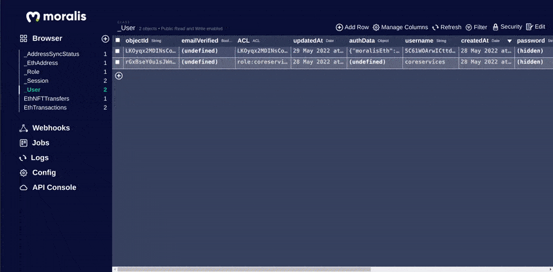
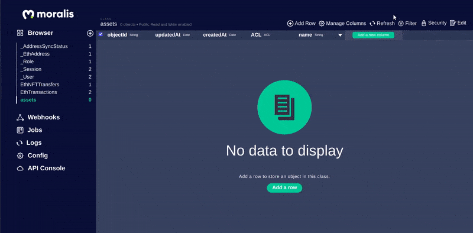
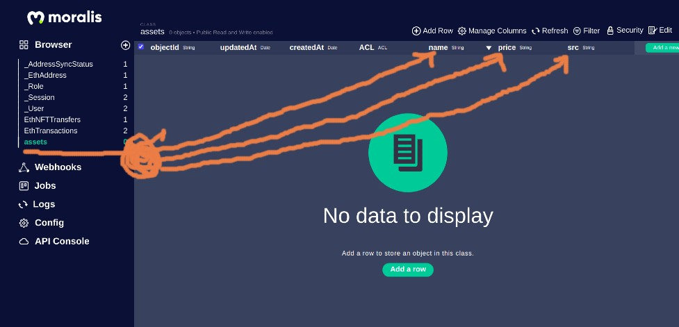
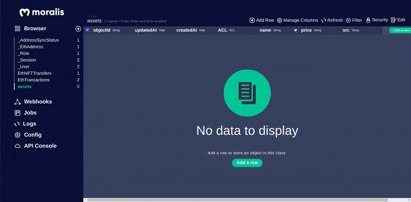
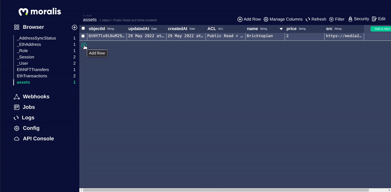

### [Build Amazon Web 3.0 Blockchain App with Solidity | Moralis | Next.js | Ethers.js | Tailwind CSS](https://youtu.be/HMdwbq1JJT0)

 <br>
 <br>

#### Check the [installation ✋](https://github.com/nadiamariduena/amazon-clone-blockchain/blob/2-Auth-moralis-context/INSTALLATION.md)

#### Check the [docs ✋](https://github.com/nadiamariduena/amazon-clone-blockchain/blob/2-Auth-moralis-context/DOCS.md)

#### Check: [Moralis server basic](https://github.com/nadiamariduena/amazon-clone-blockchain/blob/2-Auth-moralis-context/MORALISSERVER.md)

#### Check: [tailwind](https://github.com/nadiamariduena/amazon-clone-blockchain/blob/2-Auth-moralis-context/TAILWIND.md)

 <br>
 <br>

---

 <br>
 <br>

# 🥭

<!--
[]() -->

## Moralis - Mongodb

When you are using Moralis, you need not setup MongoDB manually nor do you have to provide connections to your DB. Moralis comes with an inbuilt Mongo DB that you can query and edit as you please. [stolen from this forum](https://docs.moralis.io/moralis-dapp/database/objects)

You can start learning how to use the database from here – https://docs.moralis.io/objects

<br>

#### Moralis.Object

Storing data on Moralis is built around Moralis.Object. Each Moralis.Object contains key-value pairs of JSON-compatible data. This data is schemaless, which means that you don’t need to specify ahead of time what keys exist on each Moralis.Object.

<br>

#### You simply set whatever key-value pairs you want, and our back-end will store them.

For example, let’s say you’re building an NFT game where the characters are monsters. A single Moralis.Object could contain:

<br>

```javascript
strength: 1024, ownerName: "Aegon", canFly: true
```

<br>

Keys must be alphanumeric strings. Values can be strings, numbers, booleans, or even arrays and dictionaries - anything that can be JSON-encoded.

##### Each Moralis.Object is an instance of a specific subclass with a class name that you can use to distinguish different sorts of data. For example, we could call the object a LegendaryMonster.

##### [Read More here](https://docs.moralis.io/moralis-dapp/database/objects#moralis.object)

<br>
<br>

---

<br>
<br>

### Lets get started! 🔥

#### <u>Moralis database</u> is build on top of MongoDb (read the text above)

<br>

so lets setup the **Moralis database**

- In Order to pull our assets from the database, we need to first add the assets to Moralis Database.

#### steps:

- Click on the + button

<br>

- It will open a small window ( Add new class, create a new collection of objects), so as you can see, **YOU CAN CREATE a new class**

<br>

- Select the class that you need, as you can notice, all the classes it offers us are already in our rows in the blue dashboard, but there is a **custom option**

<br>

- Once you choose **custom option**, call it **assets**

<br>

### Columns

#### Next 🍭

- Once you create the class, Add the fields for the assets by creating **COLUMNS** 👍

[]()

<br>

- Here we will add the **src** column that will store the images

[]()

<br>

[]()

<br><br>

### Rows

- Click on the green button to add a row

[]()

<br>

# 🍭

#### Now that we have the row, lets fill the columns we created before

- Here we will be adding the **name, price and src**, once we have all that we will click **add**

<br>

### Img's

- Go to [giphy.com](https://giphy.com/search/nft) and choose some **nft** related images, we will be using them inside the **src**

<br>

[]()

#### So as you can see above, I took some imgs from giphy and added them to the src

<br>

### Create another row 🍭

- We can do it one by one, but you can do it faster by using a json file

<br>

##### one by one

[]()
