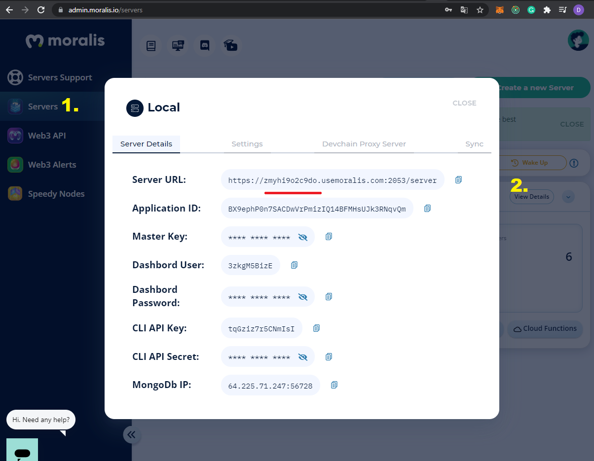
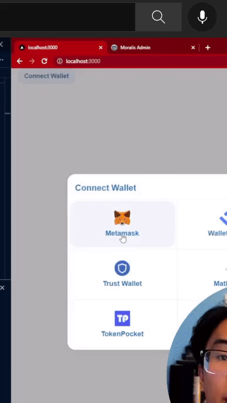

### [Build Amazon Web 3.0 Blockchain App with Solidity | Moralis | Next.js | Ethers.js | Tailwind CSS](https://youtu.be/HMdwbq1JJT0)

- Building a Web 3.0 Application on the Ethereum Blockchain

- Styling your app using Tailwind CSS

- Storing data on the blockchain

- Using Moralis and Interact with your Smart Contract written in Solidity

- Adding Web 3.0 authentication using Metamask

 <br>
 <br>

##### Ckeck the Installation here: [installation ✋](./INSTALLATION.md)

#### Ckeck the Documents here: [docs ✋](./DOCS.md)

 <br>
 <br>

---

 <br>
 <br>

# 🥭

#### After the Installation

- Go to the **pages** folder, then click on the **index.js**

- delete all and leave just this:

```javascript
export default function Home() {
  return <div className={styles.container}></div>;
}
```

<br>
<br>

#### Now lets start adding tailwind to the project

- Here we are adding tailwind to the **container**

```javascript
const styles = {
  // Check the links to see how it works
  //   h-full	height: 100%; &  w-full	height: 100%;
  // h-full https://tailwindcss.com/docs/height
  // w-full https://tailwindcss.com/docs/width
  container: `h-full w-full flex bg-[#fff]`,
};

export default function Home() {
  return <div className={styles.container}></div>;
}
```

<br>

### Create a <u>components</u> folder

- Inside the component folder, create a the **SideBar.js** component, inside the SideBar add this:

```javascript
import React from "react";

const SideBar = () => {
  return <div>SideBar</div>;
};

export default SideBar;
```

<br>

#### Now import it inside the index.js

```javascript
import SideBar from "../components/SideBar"; ✋

const styles = {
  container: `h-full w-full flex bg-[#fff]`,
};

export default function Home() {
  return (
    <div className={styles.container}>
      <SideBar /> ✋
    </div>
  );
}
```

<br>
<br>

# 🌈

## .ENV.LOCAL

[Next.js Tutorial - 64 - Environment Variables](https://youtu.be/vS86x_e0zBk)

#### [Moralis / server](https://admin.moralis.io/servers)

- Create a **.env.local** (nextjs version of the .env) file , there we will store sensitive data, (the data we have in Moralis)

<br>

> Copy your own credentials from [Moralis / server](https://admin.moralis.io/servers) ✋ (take the **Server URL** and the **Application ID**)

<br>

[]()

<br>

#### Create the variables inside the .env.local:

<br>

- the variables are: **NEXT_PUBLIC_MORALIS_SERVER**

- **NEXT_PUBLIC_MORALIS_APP_ID**

```javascript
NEXT_PUBLIC_MORALIS_SERVER=https://https:yourlongcode/server
NEXT_PUBLIC_MORALIS_APP_ID=JLzlehyourlongcode
```

<br>

### 🐒 Moralis provider

<br>

- Go to the **pages/\_app.js**

- import moralisprovider: **import { MoralisProvider } from "react-moralis";**

- Wrap the app content inside the **Moralis provider**

```javascript
function MyApp({ Component, pageProps }) {
  <MoralisProvider>
    return <Component {...pageProps} />;
  </MoralisProvider>;
}
```

<br>

### Now inside the Moralis provider tag

- add the **serverUrl** but here we will use the environments we added insid ethe **.env.local**

<br>

```javascript
  serverUrl={process.env.NEXT_PUBLIC_MORALIS_SERVER}
  appId={process.env.NEXT_PUBLIC_MORALIS_APP_ID}
```

<br>

#### Like so:

```javascript
<MoralisProvider
  serverUrl={process.env.NEXT_PUBLIC_MORALIS_SERVER}
  appId={process.env.NEXT_PUBLIC_MORALIS_APP_ID}
>
  return <Component {...pageProps} />;
</MoralisProvider>
```

<br>
<br>

#### Right now we have this inside the **\_app.js**

```javascript
import "../styles/globals.css";
import { MoralisProvider } from "react-moralis";

function MyApp({ Component, pageProps }) {
  return (
    <MoralisProvider
      serverUrl={process.env.NEXT_PUBLIC_MORALIS_SERVER}
      appId={process.env.NEXT_PUBLIC_MORALIS_APP_ID}
    >
      <Component {...pageProps} />
    </MoralisProvider>
  );
}

export default MyApp;
```

#### if at this point you have an error, just check that you didnt mistype anything or that you dont have semi colons where it shouldnt be, then stop the server and relaunch it again

```javascript
npm run dev
```

<br>
<br>

---

<br>
<br>

### Connect Button

- Go to the **SideBar.js** and import the **web3uikit** library, this button will be ready to use.

<br>

- import the

```javascript
import { ConnectButton } from "web3uikit";
```

#### And use it like so

```javascript
import React from "react";
import { ConnectButton } from "web3uikit";

const SideBar = () => {
  return (
    <div>
      <ConnectButton /> ✋
    </div>
  );
};

export default SideBar;
```

<br>

#### The incredible of this button is that it has already some functionality, so if you click on it you will have some options, since I am using metamask, i will click on it.

<br>

[]()

<br>

#### after you click on metamask, you have to click to sign in "moralis"

[]()
